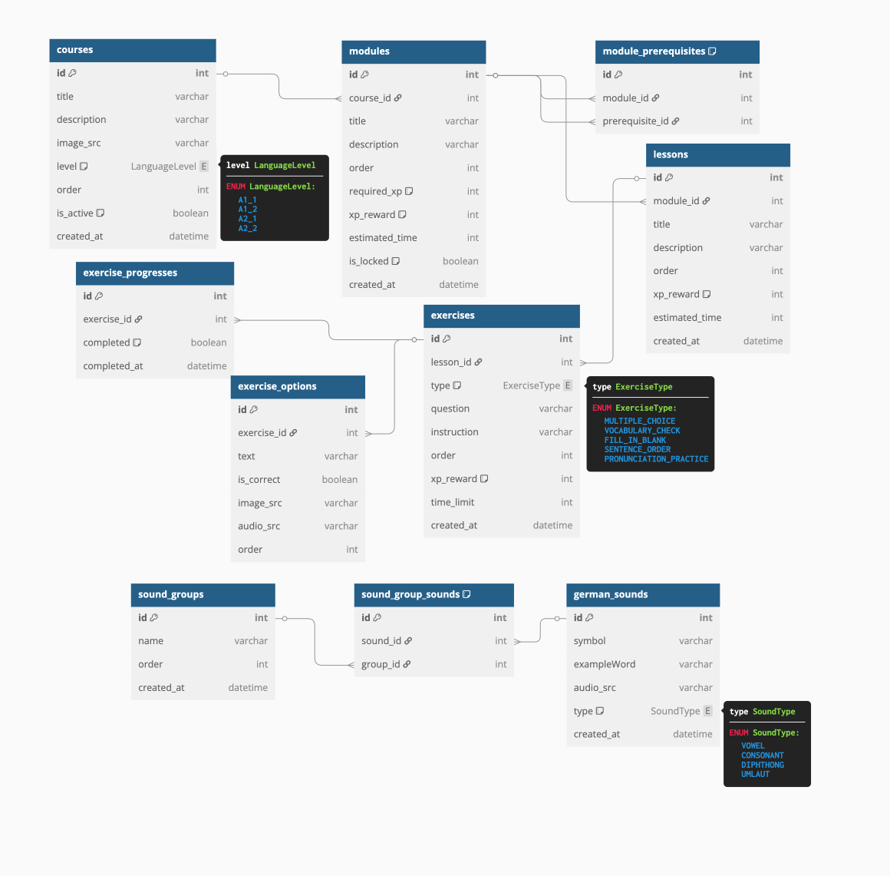

# README FOR WHOLE BACKEND

## ER Diagramm



npm run dev : lệnh sẽ giúp tự động reset khi mà code có sự thay đổi

Docker :
docker-compose up --build

## CRUD Operations (Admin/User)

In each modules API related files contains the routes only for admin (Update, Delete, Create). Why? its a common sense that only the admins have the right to manage/maniplate the contents of the modules:

- But for now, or for an MVP demo in the next 3 weeks, we are all decided to eliminate the admin CRUD operations, so we could focus entirely on the core learning experience.

- Alternative solutions: by manually seeding data, or create our own contents by manually writing the contents in seed.ts file. By doing so we can still showcase all of our platform's learning features without the management overhead. The user/learners can do tasks,quizes which are already predefined in the database.

## Understanding the Routes:

So without the admin CRUD operations, we can only focus on the GET routes for each modules.

#### 1. Course/Module Selection Screens

- `getAllCourses`: Shows the available German courses (A1.1, A1.2, etc.)
- `getAllModules`: Shows learning units within a course (Greetings, Family, etc.)
- `getCourseById`: Loads detailed course info when selected
- `getModuleById`: Loads a module's content when clicked

#### 2. Content Navigation

- `getAllLessons`: Shows lessons within a module
- `getAllExercises`: Loads the exercise sequence for a lesson

#### 3. Tracking Display

- Shows which lessons/modules are completed vs locked/unlocked
- Displays overall progress in the learning journey

#### User Journey Example

1. User logs in website -> `getAllCourses` loads available German levels
2. User select, e.g "German A1.1" -> `getCourseById` loads course details
3. User sees module list -> `getAllModules` loads all the Modules in order (and shows which one is locked/unlocked)

## Setup Social Login with Clerk

# Frontend

```bash
cd frontend
npm install @clerk/clerk-react
```

```bash
# Backend
cd backend
npm install @clerk/clerk-sdk-node
```
