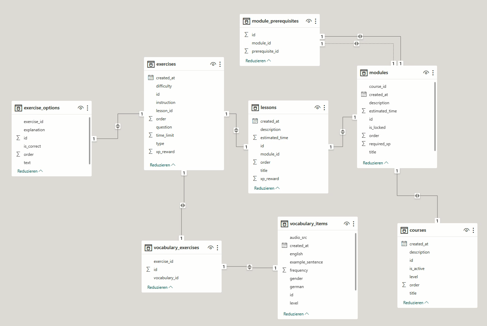

# README FOR WHOLE BACKEND

## ER Diagramm

npm run dev : lệnh sẽ giúp tự động reset khi mà code có sự thay đổi

(for Thiện) : chú ý thay đổi file Dockerfile sang run in production ở cuối dự án

Docker :
docker-compose up --build

## CRUD Operations (Admin/User)

In each modules API related files contains the routes only for admin (Update, Delete, Create). Why? its a common sense that only the admins have the right to manage/maniplate the contents of the modules

-> But for now, or for an MVP demo in the next 3 weeks, we are all decided to eliminate the admin CRUD operations, so we could focus entirely on the core learning experience.

-> Alternative solutions: by manually seeding data, or create our own contents by manually writing the contents in seed.ts file. By doing so we can still showcase all of our platform's learning features without the management overhead. The user/learners can do tasks,quizes which are already predefined in the database.

## Understanding the Routes:
So without the admin CRUD operations, we can only focus on the GET routes for each modules.

