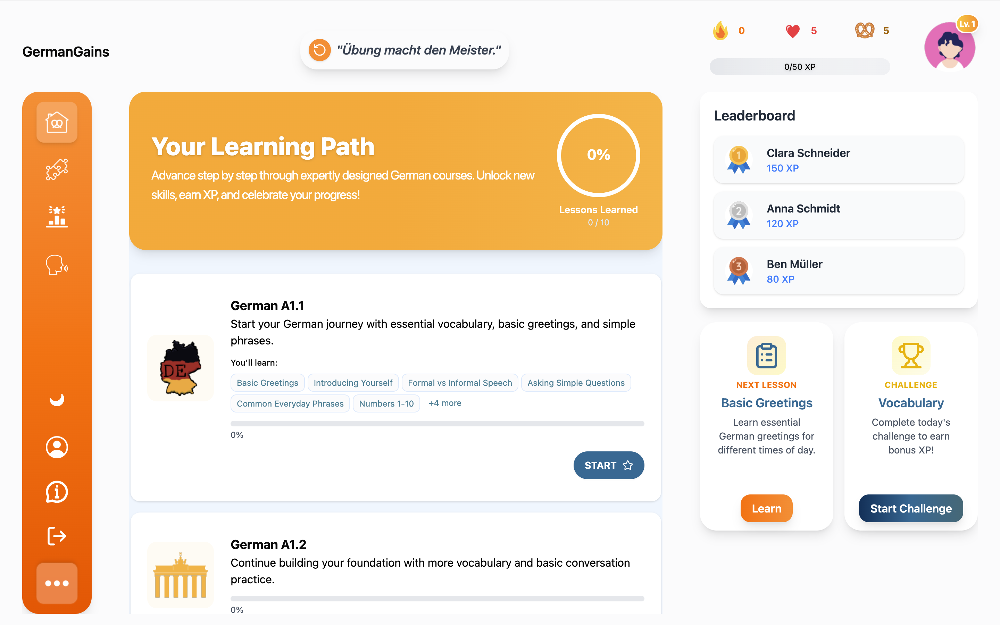
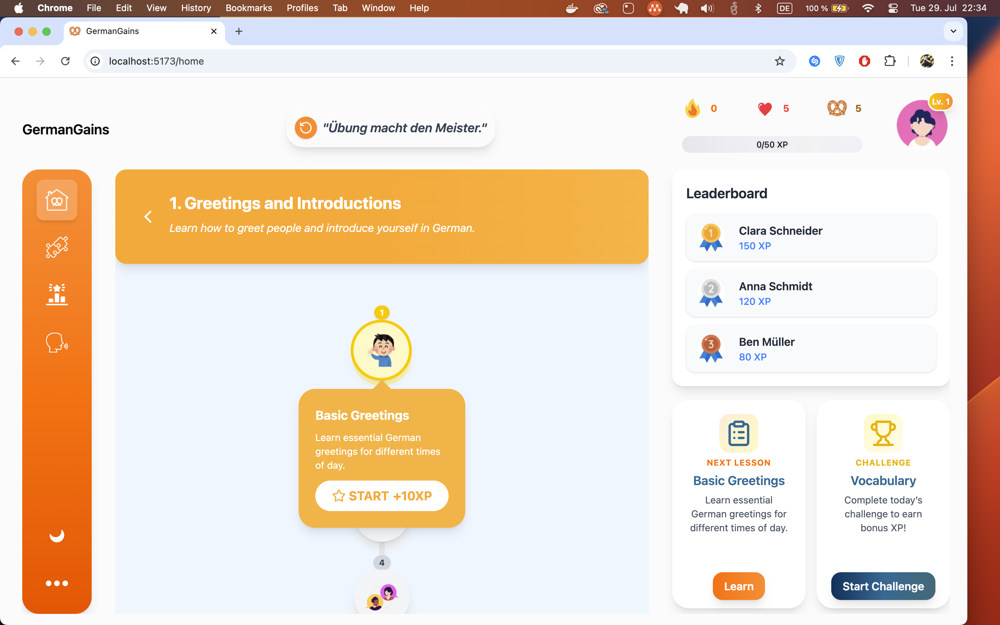
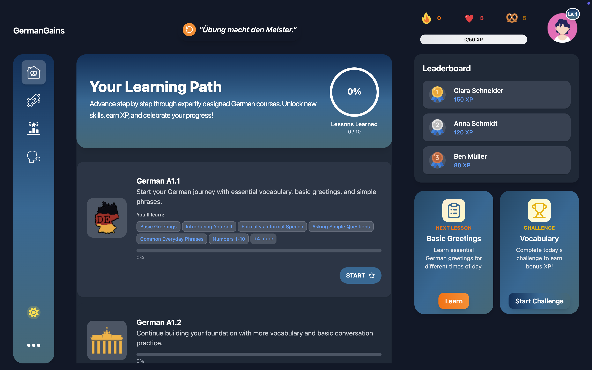
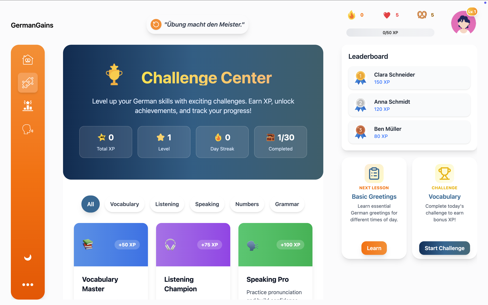
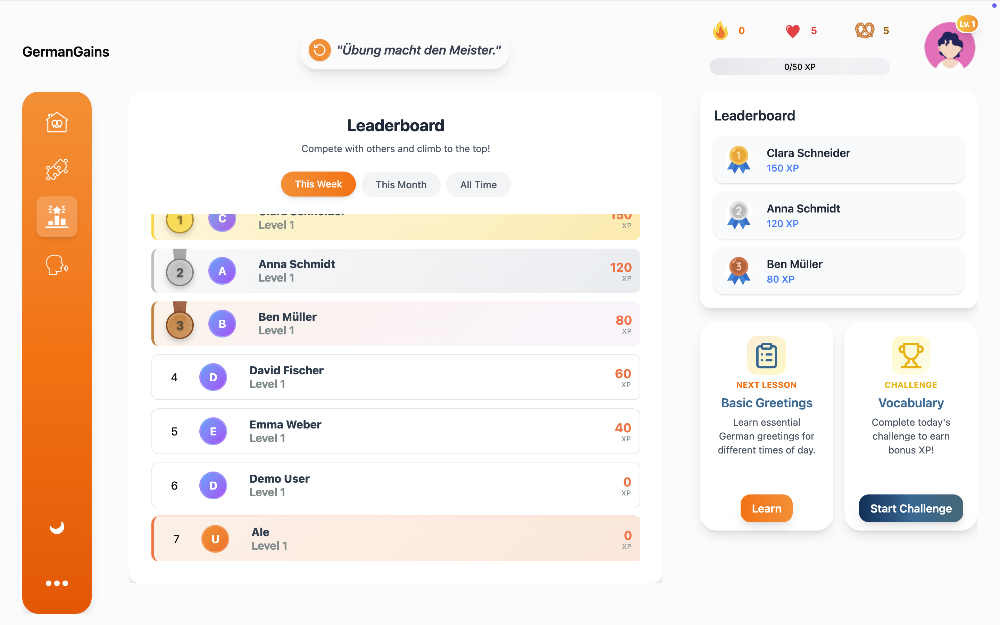
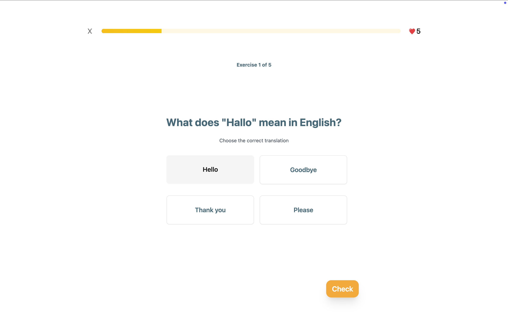
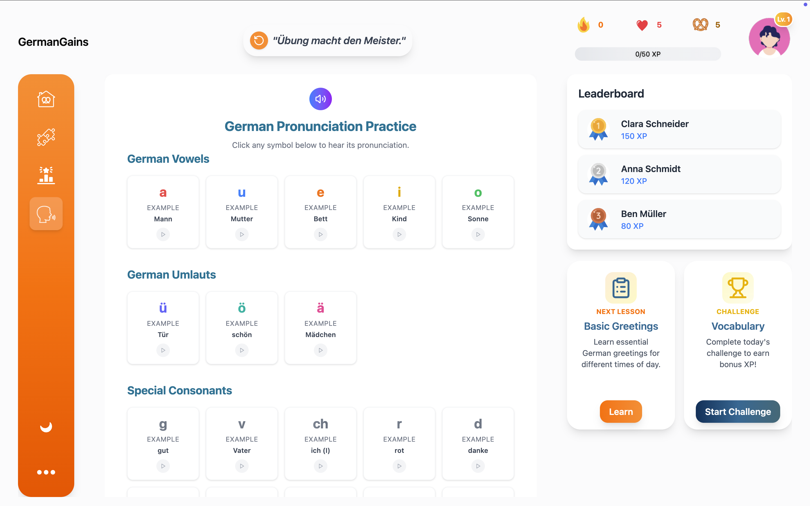
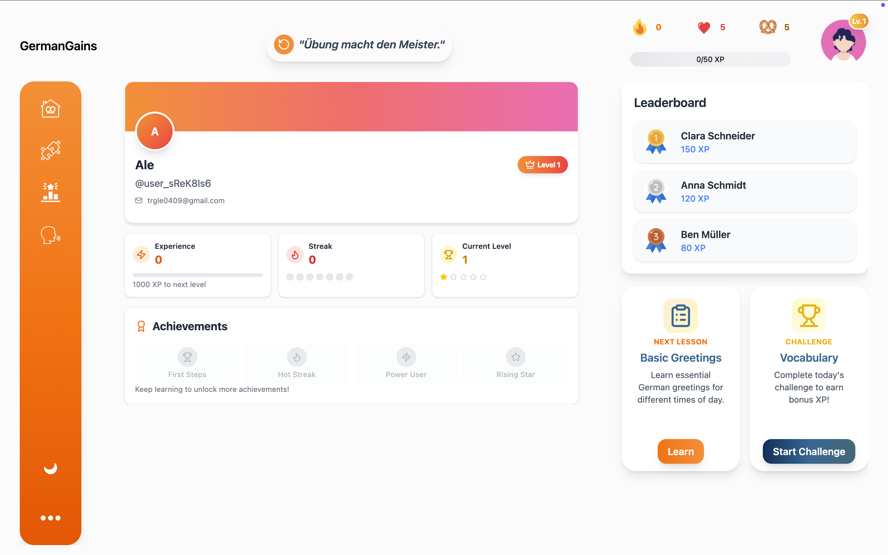
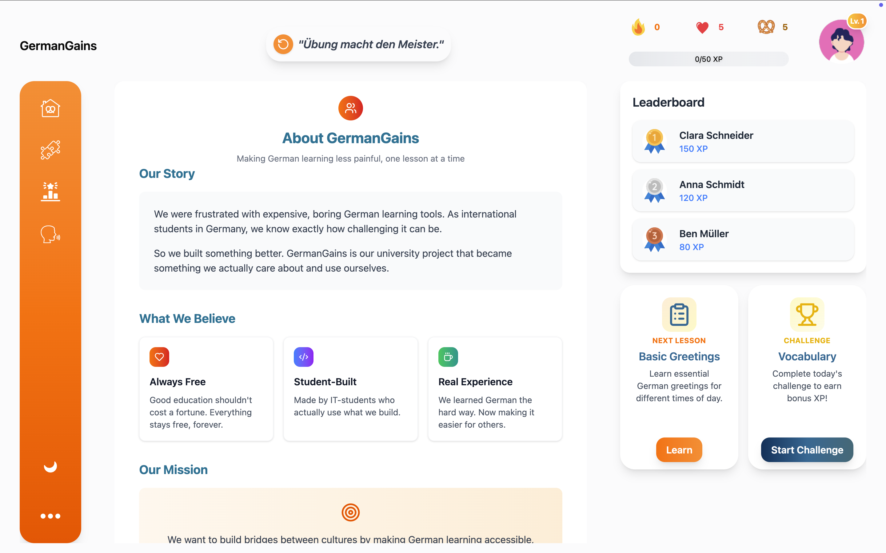

# GermanGains Frontend

A modern React-based German language learning platform with interactive exercises, progress tracking, and gamified learning experience.

## 📸 Application Screenshots

### 🏠 Main Dashboard - Learning Path

*The main dashboard showing the learning path with course cards, progress tracking, and navigation elements.*

### 📚 Learning Path Detail View

*Detailed view of the learning path showing lesson progression, course modules, and interactive learning elements.*

### 🌙 Dark Mode Interface

*The application in dark mode showing the alternative color scheme and theme toggle functionality.*

### 🎯 Challenge Center

*The challenge center interface displaying user statistics, challenge categories, and available challenges.*

### 📊 Leaderboard Page

*The leaderboard page showing user rankings, XP scores, and competitive elements.*

### 🎓 Learning Interface - Exercise

*The learning interface displaying a multiple-choice exercise with progress tracking and navigation.*

### 🗣️ Pronunciation Practice

*The pronunciation practice section with German vowels, umlauts, and special consonants.*

### 👤 User Profile Dashboard

*The user profile dashboard showing personal statistics, achievements, and progress tracking.*


### ℹ️ About Us Page

*The about us page showcasing the project story, mission, and team information.*

---

## 📋 Table of Contents

- [Overview](#overview)
- [Tech Stack](#tech-stack)
- [Prerequisites](#prerequisites)
- [Installation](#installation)
- [Project Structure](#project-structure)
- [Component Architecture](#component-architecture)
- [Custom Hooks](#custom-hooks)
- [Styling System](#styling-system)
- [State Management](#state-management)
- [API Integration](#api-integration)
- [Testing](#testing)
- [Deployment](#deployment)
- [Development Guide](#development-guide)
- [Troubleshooting](#troubleshooting)
- [Additional Resources](#additional-resources)
- [Installation Commands](#installation-commands)

---

## 🎯 Overview

GermanGains is a comprehensive German language learning application built with React and TypeScript. The platform features interactive exercises, progress tracking, gamification elements, and a modern user interface designed to make learning German engaging and effective.

### Key Features
- **Interactive Learning Paths**: Structured course progression with modules and lessons
- **Multiple Exercise Types**: Fill-in-blank, multiple choice, vocabulary checks, and pronunciation exercises
- **Progress Tracking**: Real-time XP, level progression, and streak tracking
- **Gamification**: Hearts system, achievements, and leaderboards
- **Responsive Design**: Works seamlessly across desktop and mobile devices
- **Dark Mode Support**: Toggle between light and dark themes

## 🛠 Tech Stack

### Core Technologies
- **React 18** - UI library with hooks and functional components
- **TypeScript** - Type-safe JavaScript development
- **Vite** - Fast build tool and development server
- **React Router v6** - Client-side routing

### UI & Styling
- **Tailwind CSS** - Utility-first CSS framework
- **shadcn/ui** - Reusable component library
- **Lucide React** - Modern icon library
- **FontAwesome** - Additional icon support
- **Framer Motion** - Page transitions and animations
- **GSAP** - Advanced animations

### State Management & Data
- **React Context API** - Global state management
- **Custom Hooks** - Reusable logic and data fetching
- **MSW (Mock Service Worker)** - API mocking for development

### Development Tools
- **ESLint** - Code linting
- **Prettier** - Code formatting
- **Vitest** - Unit testing framework
- **@types/node** - TypeScript definitions

## 📋 Prerequisites

Before you begin, ensure you have the following installed:

- **Node.js** (v18 or higher)
- **npm** (v8 or higher) or **yarn** (v1.22 or higher)
- **Git** for version control

## 🚀 Installation

### 1. Clone the Repository
```bash
git clone <repository-url>
cd fwe-lernplattform/frontend
```

### 2. Install Dependencies
```bash
npm install
```

### 3. Environment Setup
Create a `.env` file in the frontend directory:
```env
VITE_API_BASE_URL=http://localhost:3000
VITE_CLERK_PUBLISHABLE_KEY=your_clerk_key_here
```

### 4. Start Development Server
```bash
npm run dev
```

The application will be available at `http://localhost:5173`

## 📁 Project Structure

```
frontend/
├── public/                 # Static assets
│   ├── mockServiceWorker.js
│   └── index.html
├── src/
│   ├── assets/            # Images, icons, and static files
│   ├── components/        # React components
│   │   ├── layout/        # Layout components
│   │   ├── pages/         # Page components
│   │   ├── learn/         # Learning interface
│   │   ├── login/         # Authentication
│   │   ├── panels/        # Dashboard panels
│   │   ├── ui/            # Reusable UI components
│   │   └── hooks/         # Custom React hooks
│   ├── style/             # Custom CSS files
│   ├── lib/               # Utility functions
│   ├── App.tsx            # Main app component
│   ├── main.tsx           # Entry point
│   └── index.css          # Global styles
├── package.json
├── vite.config.ts
├── tsconfig.json
└── README.md
```

## 🗺️ Application Sitemap

### Public Pages (Unauthenticated)
```
LandingPage (/)
├── Hero Section
├── Features Overview
├── Benefits
├── Testimonials
└── Call-to-Action

LoginPage (/login)
├── Login Form
├── Social Login Options
└── Link to Registration

RegisterPage (/register)
├── Registration Form
├── Terms & Conditions
└── Link to Login
```

### Protected Pages (Authenticated)
```
MainLayout (/)
├── TopBar
│   ├── Logo
│   ├── German Quote
│   └── User Stats (XP, Level, Streak, Hearts)
├── LeftBar (Navigation)
│   ├── Home (/home)
│   ├── Challenge (/challenge)
│   ├── Ranking (/ranking)
│   ├── Pronunciation (/pronunciation)
│   ├── Dark Mode Toggle
│   └── More Menu
│       ├── Profile (/profile)
│       ├── About Us (/aboutus)
│       └── Logout
├── MainContent
│   └── Page Content
└── RightBar
    ├── Leaderboard Panel
    ├── Next Lesson Reminder
    └── Challenge Reminder
```

### Page Details

#### 🏠 Home Page (/home)
- **Purpose**: Main dashboard after login
- **Features**:
  - Learning path overview
  - Course cards (A1.1, A1.2, etc.)
  - Progress tracking
  - Quick access to lessons
- **Components**: `Home.tsx`, `MainContent.tsx`, `CourseCard.tsx`

#### 🎯 Challenge Page (/challenge)
- **Purpose**: Challenge center and gamification
- **Features**:
  - User statistics (Total XP, Level, Streak, Completed)
  - Challenge categories (Vocabulary, Listening, Speaking, etc.)
  - Available challenges
  - Progress tracking
- **Components**: `Challenge.tsx`

#### 📊 Ranking Page (/ranking)
- **Purpose**: Leaderboard and competition
- **Features**:
  - User rankings
  - XP scores
  - Time filters (This Week, This Month, All Time)
  - Competitive elements
- **Components**: `Ranking.tsx`

#### 🗣️ Pronunciation Page (/pronunciation)
- **Purpose**: German pronunciation practice
- **Features**:
  - German vowels (a, u, e, i, o)
  - German umlauts (ü, ö, ä)
  - Special consonants (g, v, ch, r, d)
  - Audio pronunciation examples
- **Components**: `Pronunciation.tsx`

#### 👤 Profile Page (/profile)
- **Purpose**: User profile and statistics
- **Features**:
  - User information
  - Detailed statistics
  - Achievements
  - Progress tracking
  - Settings
- **Components**: `Profile.tsx`

#### ℹ️ About Us Page (/aboutus)
- **Purpose**: Project information and team details
- **Features**:
  - Project story
  - Mission statement
  - Team information
  - Values and beliefs
- **Components**: `AboutUs.tsx`

#### 📚 Learning Interface (/learn/:lessonId)
- **Purpose**: Interactive learning experience
- **Features**:
  - Exercise progression
  - Multiple exercise types
  - Progress tracking
  - Hearts system
  - Lesson summary
- **Components**: `Learn.tsx`, `LearningContent.tsx`, `LearningHeader.tsx`

### Navigation Flow

```
Landing Page
    ↓
Login/Register
    ↓
Home Dashboard
    ↓
├── Learning Path → Lesson Interface
├── Challenge Center
├── Leaderboard
├── Pronunciation Practice
├── Profile
└── About Us
```

### Component Hierarchy

```
App.tsx
├── Router
    ├── Public Routes
    │   ├── LandingPage
    │   ├── LoginPage
    │   └── RegisterPage
    └── Protected Routes (MainLayout)
        ├── TopBar
        ├── LeftBar
        ├── Page Components
        │   ├── Home
        │   ├── Challenge
        │   ├── Ranking
        │   ├── Pronunciation
        │   ├── Profile
        │   ├── AboutUs
        │   └── Learn
        └── RightBar
```

## 🎨 Component Architecture

### Layout Components (`components/layout/`)
- **LeftBar.tsx** - Main navigation sidebar with menu system
- **RightBar.tsx** - Information panels (leaderboard, reminders)
- **TopBar.tsx** - Header with logo, stats, and profile
- **MainLayout.tsx** - Main layout wrapper
- **MainContent.tsx** - Central content area

### Page Components (`components/pages/`)
- **LandingPage.tsx** - Public landing page
- **LoginPage.tsx** - User authentication
- **RegisterPage.tsx** - User registration
- **Home.tsx** - Dashboard after login
- **Learn.tsx** - Learning interface
- **Profile.tsx** - User profile and stats
- **Challenge.tsx** - Challenge center
- **Ranking.tsx** - Leaderboards
- **AboutUs.tsx** - About page

### Learning Components (`components/learn/`)
- **LearningContent.tsx** - Main learning logic
- **LearningHeader.tsx** - Lesson progress and controls
- **LearningFooter.tsx** - Action buttons
- **FillInBlankExercise.tsx** - Fill-in-blank exercises
- **MultipleChoiceExercise.tsx** - Multiple choice questions
- **VocabCheckExercise.tsx** - Vocabulary exercises
- **PronunciationExercise.tsx** - Pronunciation practice

### Learning Path Components (`components/learning-path/`)
- **CourseCard.tsx** - Course selection cards
- **VerticalStep.tsx** - Learning path visualization
- **LessonHeader.tsx** - Module information
- **StartBubble.tsx** - Active lesson indicator
- **DetailBubble.tsx** - Lesson details
- **LockedBubble.tsx** - Locked lesson indicator

## 🔧 Custom Hooks

### Data Fetching Hooks
- **useCoursesWithProgress.ts** - Fetch courses with user progress
- **useAllModulesLessonProgress.ts** - Fetch lesson progress for multiple modules
- **useLessonModuleProgress.ts** - Fetch progress for single module
- **useLessonExercises.ts** - Fetch exercises for a lesson
- **useExerciseCheck.ts** - Check exercise answers and provide feedback

### Authentication Hooks
- **useAuth.tsx** - User authentication state
- **useAuthJWT.tsx** - JWT-based authentication
- **useLogOut.tsx** - Logout functionality

### UI Hooks
- **useLeaderboard.ts** - Leaderboard data
- **useUserProfile.tsx** - User profile management
- **useVocabularyGroups.tsx** - Vocabulary management

## 🎨 Styling System

### Tailwind CSS
The project uses Tailwind CSS for styling with custom configuration:
- **Custom colors** for brand consistency
- **Responsive design** utilities
- **Dark mode** support
- **Custom animations** and transitions

### Component Styling
- **shadcn/ui** components for consistent UI
- **Custom CSS classes** for specific styling needs
- **CSS modules** for component-specific styles

### Typography System
Standardized typography classes for consistency:
- `.text-title` - Main page headers
- `.text-body` - Primary content text
- `.text-caption` - Small labels and metadata
- `.text-display` - Large decorative text

## 🔄 State Management

### Context API
- **MenuContext** - Manages sidebar menu state
- **AuthContext** - User authentication state
- **ThemeContext** - Dark/light mode toggle

### Local State
- **useState** for component-specific state
- **useReducer** for complex state logic
- **Custom hooks** for reusable state logic

## 🌐 API Integration

### Backend Communication
- **RESTful API** calls using fetch
- **Error handling** and loading states
- **Data caching** for performance
- **Mock data** for development

### Authentication
- **JWT tokens** for API authentication
- **Clerk integration** for social login
- **Session management**

## 🧪 Testing

### Unit Testing
```bash
npm run test
```

### Testing Structure
- **Component tests** for UI components
- **Hook tests** for custom logic
- **Utility tests** for helper functions

## 🚀 Deployment

### Build for Production
```bash
npm run build
```

### Environment Variables
Ensure all required environment variables are set:
- `VITE_API_BASE_URL`
- `VITE_CLERK_PUBLISHABLE_KEY`

### Deployment Platforms
- **Vercel** (recommended)
- **Netlify**
- **AWS S3 + CloudFront**

## 🔧 Development Guide

### Code Style
- **ESLint** configuration for code quality
- **Prettier** for consistent formatting
- **TypeScript** strict mode enabled

## 🐛 Troubleshooting

### Common Issues

#### Build Errors
```bash
# Clear cache and reinstall dependencies
rm -rf node_modules package-lock.json
npm install
```

#### TypeScript Errors
```bash
# Check TypeScript configuration
npx tsc --noEmit
```

#### Styling Issues
- Ensure Tailwind CSS is properly configured
- Check for CSS conflicts
- Verify responsive breakpoints

### Performance Optimization
- **Code splitting** for route-based loading
- **Image optimization** for assets
- **Lazy loading** for components
- **Memoization** for expensive calculations

## 📚 Additional Resources

### Official Documentation
- [React Documentation](https://react.dev/)
- [TypeScript Handbook](https://www.typescriptlang.org/docs/)
- [Tailwind CSS Documentation](https://tailwindcss.com/docs)
- [Vite Documentation](https://vitejs.dev/guide/)
- [shadcn/ui Documentation](https://ui.shadcn.com/)

## 🔧 Installation Commands

### Core Dependencies
```bash
# Install React Router and utilities
npm install react-router-dom lucide-react clsx
```

### UI Components (shadcn/ui)
```bash
# Initialize shadcn/ui
npx shadcn-ui@latest init

# Add required components
npx shadcn@latest add button
npx shadcn@latest add input
npx shadcn@latest add card
npx shadcn@latest add label
npx shadcn@latest add checkbox
npx shadcn@latest add progress

# Install TypeScript types
npm install -D @types/node
```

### Icon Libraries
```bash
# Install FontAwesome
npm install --save @fortawesome/fontawesome-svg-core
npm install --save @fortawesome/free-solid-svg-icons
npm install --save @fortawesome/react-fontawesome
npm install --save @fortawesome/free-brands-svg-icons
```

### Development Tools

```bash
# Install Mock Service Worker for API mocking
npm install msw@1 --save-dev

# Initialize MSW
npx msw init public/ --save
```

### Animation Libraries
```bash
# Install GSAP for advanced animations
npm install gsap

# Install Framer Motion for page transitions
npm install framer-motion
```

### Complete Installation (All at once)
```bash
# Core dependencies
npm install react-router-dom lucide-react clsx

# UI components
npx shadcn-ui@latest init
npx shadcn@latest add button input card label checkbox progress
npm install -D @types/node

# Icons
npm install --save @fortawesome/fontawesome-svg-core @fortawesome/free-solid-svg-icons @fortawesome/react-fontawesome @fortawesome/free-brands-svg-icons

# Development tools
npm install msw@1 --save-dev
npx msw init public/ --save

# Animations
npm install gsap framer-motion
```

---

**Note**: This documentation is maintained by the frontend development team. For questions or issues, please refer to the project's issue tracker or contact the development team.

